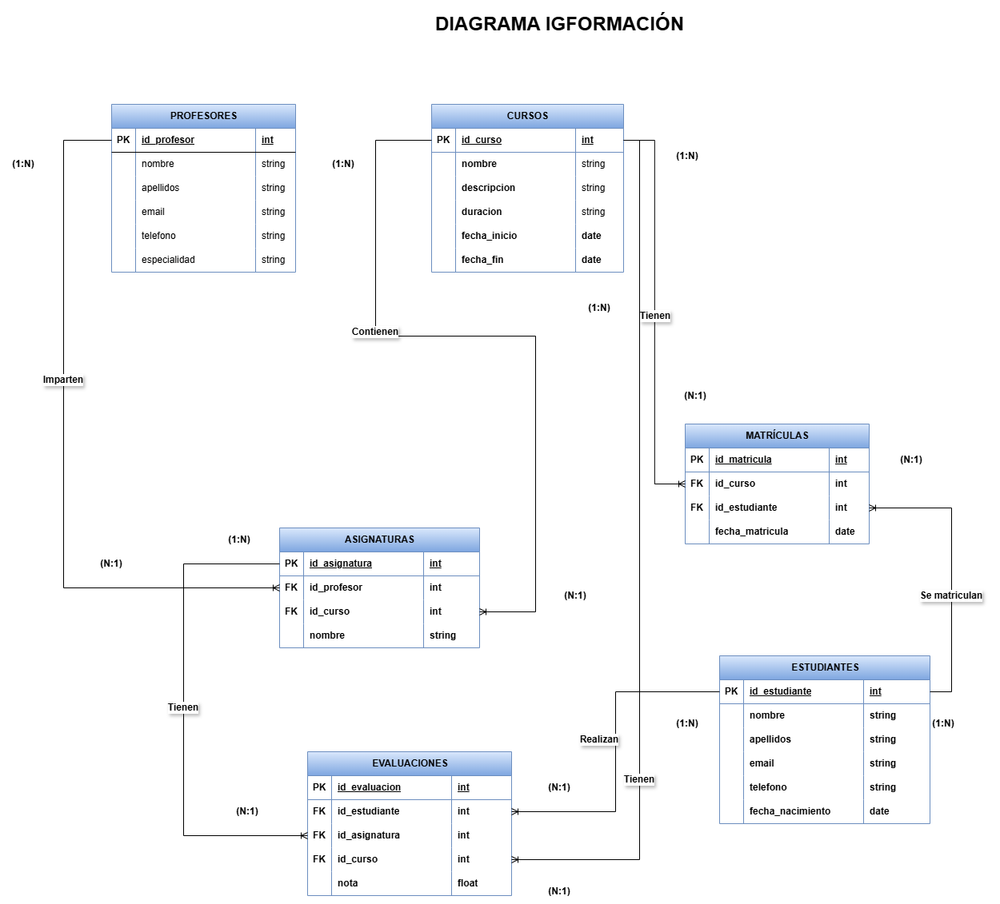

# Sistema de Gestión Académica IGFormación

## Descripción del problema

IGFormación es un centro de estudios que ofrece programas de formación profesional superior en **Desarrollo de Aplicaciones Multiplataforma (DAM)** y **Desarrollo de Aplicaciones Web (DAW)**.

La dirección del centro desea un sistema de gestión académica que facilite la administración de:
- **Estudiantes:** Registrar datos personales como nombre, apellidos, email, teléfono y fecha de nacimiento.
- **Cursos:** Gestionar cursos con su información básica, duración, y fechas.
- **Asignaturas:** Asociar asignaturas específicas a cada curso, indicando el profesor encargado.
- **Profesores:** Registrar datos personales de los profesores y las asignaturas que imparten.
- **Matrículas:** Administrar la relación entre estudiantes y cursos, registrando la fecha de matrícula.
- **Evaluaciones:** Registrar las notas de los estudiantes por cada asignatura, calcular su promedio y generar estadísticas.

### Funcionalidades principales
El sistema permitirá:
1. **Registro de estudiantes:** Capturar y almacenar sus datos personales.
2. **Gestión de profesores:** Registrar y consultar los datos de los profesores, y asociarlos con asignaturas.
3. **Gestión de cursos:** Crear, editar y consultar información sobre los cursos disponibles.
4. **Gestión de matrículas:** Asociar estudiantes a los cursos que cursan, registrando la fecha de inscripción.
5. **Gestión de asignaturas:** Registrar asignaturas específicas y asignar profesores y cursos.
6. **Evaluaciones:** Almacenar las notas de los estudiantes y calcular automáticamente:
   - Promedio de notas por estudiante.
   - Porcentaje de aprobados por asignatura.
   - Porcentaje de aprobados por curso.

### Objetivo del sistema
Proporcionar una herramienta eficiente que facilite:

   - La planificación académica, tanto de cursos como de asignaturas.
   - El seguimiento del progreso de los estudiantes y las evaluaciones.
   - La gestión administrativa de profesores y matrículas.
   - La toma de decisiones basada en datos analíticos, como estadísticas de aprobados y promedios.


### Diagrama del modelo entidad-relación (E-R)



---

## Way of Working (WoW)

### Requisitos tecnológicos

Para trabajar en este proyecto, necesitarás los siguientes componentes instalados y configurados en tu entorno de desarrollo:

- **Sistema Operativo**: 
  - Cualquier distribución de Linux compatible (probado en Ubuntu 22.04 y derivados).
  - También funciona en Windows y macOS con las configuraciones apropiadas.

- **Dependencias principales**:
  - **PHP**: >= 8.1 (Incluyendo extensiones necesarias como `php-mysql` y `php-xml`).
  - **Composer**: Gestor de dependencias para PHP.
  - **Docker y Docker Compose**: Para la base de datos MariaDB.
  - **Laravel 11.x**: Framework PHP utilizado para desarrollar este proyecto.

- **Servicios requeridos**:
  - **Servidor de base de datos**: MariaDB.
  - **Servidor local**: Servidor integrado de Laravel (`php artisan serve`).

- **Herramientas opcionales**:
  - **Postman**: Para probar y validar las APIs.
  - **VS Code**: Editor de texto recomendado con extensiones para Laravel y PHP.
  - **Git**: Control de versiones para el proyecto.

---

### Pasos para ejecutar el proyecto

1. **Clonar el repositorio**
   - Abre una terminal y ejecuta:
     ```bash
     git clone https://github.com/IvanFerrerF/PracticaFinal_IGFormacion.git
     cd PracticaFinal_IGFormacion
     ```

2. **Instalar dependencias**
   - Instala las dependencias de Laravel con Composer:
     ```bash
     composer install
     ```

3. **Configurar el entorno**
   - Copia el archivo `.env.example` y renómbralo como `.env`:
     ```bash
     cp .env.example .env
     ```
   - Edita el archivo `.env` para establecer los detalles de conexión a la base de datos:
     ```env
     DB_CONNECTION=mysql
     DB_HOST=127.0.0.1
     DB_PORT=3306
     DB_DATABASE=igformacion
     DB_USERNAME=root
     DB_PASSWORD=m1_s3cr3t
     ```

4. **Levantar la base de datos**
   - Asegúrate de que Docker esté en ejecución.
   - Construye y ejecuta el contenedor de MariaDB:
     ```bash
     docker start mariadb-server
     docker exec -it mariadb-server mariadb -u root -p
     ```
   - En el cliente de MariaDB, crea la base de datos:
     ```sql
     CREATE DATABASE igformacion;
     ```

5. **Migrar la base de datos**
   - Limpia la configuración en caché:
     ```bash
     php artisan config:clear
     ```
   - Ejecuta las migraciones para crear las tablas:
     ```bash
     php artisan migrate
     ```

6. **Rellenar datos iniciales**
   - Utiliza los seeders y factories para poblar la base de datos con datos de prueba:
     ```bash
     php artisan db:seed
     ```

7. **Arrancar el servidor**
   - Levanta el servidor de desarrollo:
     ```bash
     php artisan serve
     ```
   - Accede al sistema en tu navegador:
     ```
     http://127.0.0.1:8000
     ```

8. **Probar las APIs**
   - Abre Postman y realiza pruebas de las rutas configuradas en `routes/api.php`.
   - Las rutas deben responder con datos en formato JSON si se incluye el encabezado:
     ```
     accept: application/json
     ```

---

### Consideraciones finales

Este procedimiento asegura que cualquier desarrollador pueda levantar el proyecto desde cero siguiendo los pasos descritos. Además, incluir herramientas como Postman y Docker mejora la profesionalidad y la facilidad de despliegue del proyecto.

## Requisitos tecnológicos y cómo instalarlos

A continuación, se describen los pasos para instalar las herramientas necesarias para trabajar en este proyecto.

### PHP

PHP es el lenguaje en el que se desarrolla Laravel. Necesitarás al menos la versión 8.1.

#### Instalación en Ubuntu 

Actualiza el sistema:
```bash
sudo apt update && sudo apt upgrade
```
Agrega el repositorio de PHP:
```bash
sudo add-apt-repository ppa:ondrej/php
sudo apt update
```
Instala PHP y las extensiones necesarias:
```bash
sudo apt install php8.1 php8.1-cli php8.1-fpm php8.1-mysql php8.1-xml php8.1-mbstring php8.1-curl php8.1-zip
```
Verifica la instalación:
```bash
    php -v
```
#### Instalación en Windows

Descarga el instalador de PHP desde la página oficial:  
[Descargar PHP para Windows](https://windows.php.net/download/)

Extrae los archivos en una carpeta, por ejemplo, `C:\php`.
Agrega `C:\php` al Path en las variables de entorno.

Verifica la instalación abriendo una terminal y ejecutando:

```bash
    php -v
```
#### Instalación en macOS

    Instala Homebrew si no lo tienes:
```bash
/bin/bash -c "$(curl -fsSL https://raw.githubusercontent.com/Homebrew/install/HEAD/install.sh)"
```
Instala PHP con Homebrew:
```bash
brew install php
```
Verifica la instalación:
```
    php -v
```
### Composer

Composer es el gestor de dependencias para PHP y se requiere para instalar Laravel.

#### Instalación en cualquier sistema operativo

Descarga Composer ejecutando:
```bash
php -r "copy('https://getcomposer.org/installer', 'composer-setup.php');"
php composer-setup.php
php -r "unlink('composer-setup.php');"
```
Mueve el ejecutable a una ubicación accesible globalmente:
```bash
sudo mv composer.phar /usr/local/bin/composer
```
Verifica la instalación:
```bash
    composer --version
```
#### Instalación en Windows

Descarga el instalador desde:
https://getcomposer.org/Composer-Setup.exe
Sigue las instrucciones del instalador.

Verifica la instalación:

    composer --version

### Docker y Docker Compose

Docker se utiliza para crear el contenedor de MariaDB.
Instalación en Ubuntu

#### Instala Docker:

    sudo apt update
    sudo apt install docker.io

Habilita Docker para que se inicie automáticamente:

    sudo systemctl start docker
    sudo systemctl enable docker

#### Instala Docker Compose:

    sudo curl -L "https://github.com/docker/compose/releases/download/1.29.2/docker-compose-$(uname -s)-$(uname -m)" -o /usr/local/bin/docker-compose
    sudo chmod +x /usr/local/bin/docker-compose

Verifica las instalaciones:

    docker --version
    docker-compose --version

#### Instalación en Windows y macOS

Descarga Docker Desktop desde:
https://www.docker.com/products/docker-desktop
Instálalo siguiendo las instrucciones del instalador.
    Verifica la instalación:

    docker --version
    docker-compose --version
    
### Laravel

Laravel se instala usando Composer.

Instala el instalador global de Laravel:

    composer global require laravel/installer

Agrega el directorio global de Composer a tu PATH:

    export PATH="$HOME/.config/composer/vendor/bin:$PATH"  # Ubuntu/Linux

Verifica la instalación:

    laravel --version

### MariaDB

MariaDB será la base de datos utilizada en este proyecto.
Instalación en Ubuntu

#### Instala MariaDB:

    sudo apt update
    sudo apt install mariadb-server mariadb-client

Inicia el servicio:

    sudo systemctl start mariadb
    sudo systemctl enable mariadb

Asegura la instalación:

    sudo mysql_secure_installation

#### Instalación en Windows y macOS

Descarga MariaDB desde:
https://mariadb.org/download/
Sigue las instrucciones del instalador.

### Postman

Postman es una herramienta para probar las APIs.

Descarga Postman desde:
https://www.postman.com/downloads/
Instálalo siguiendo las instrucciones para tu sistema operativo.

### VS Code

VS Code es el editor de texto recomendado.

Descarga VS Code desde:
https://code.visualstudio.com/

  Instálalo y agrega extensiones útiles:
      Laravel Extension Pack
      PHP Intelephense
      Docker


